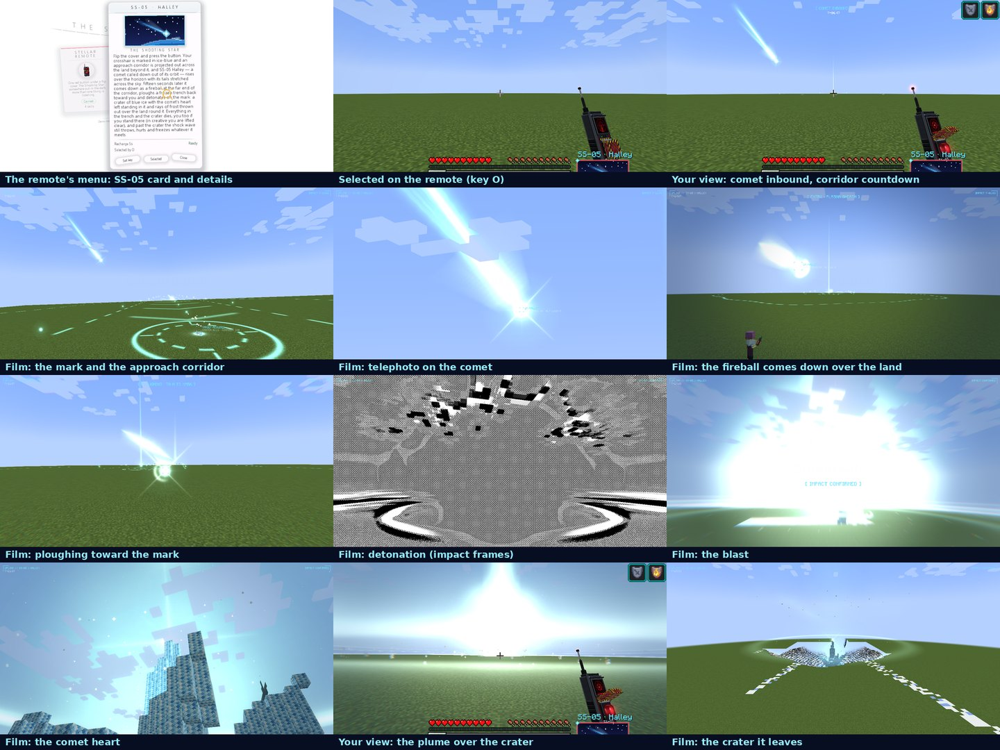
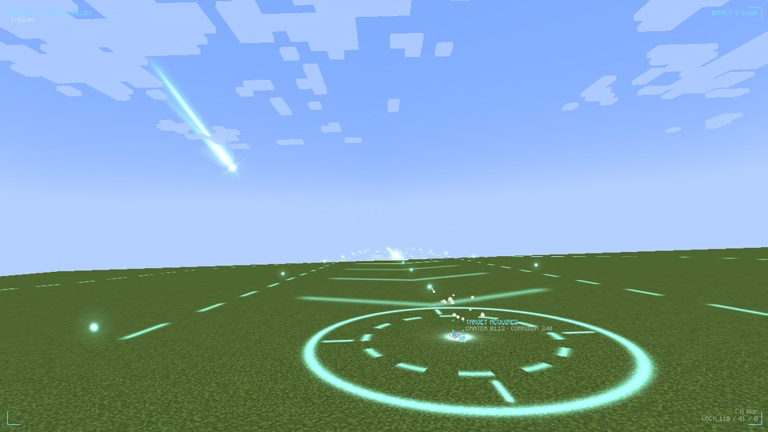
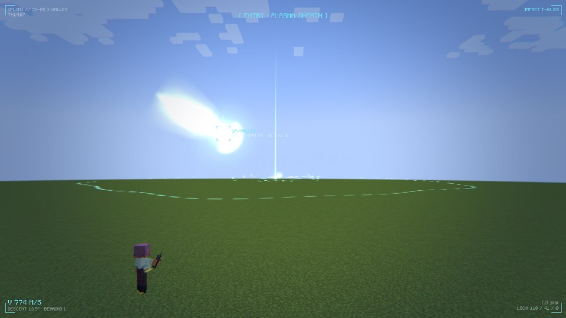
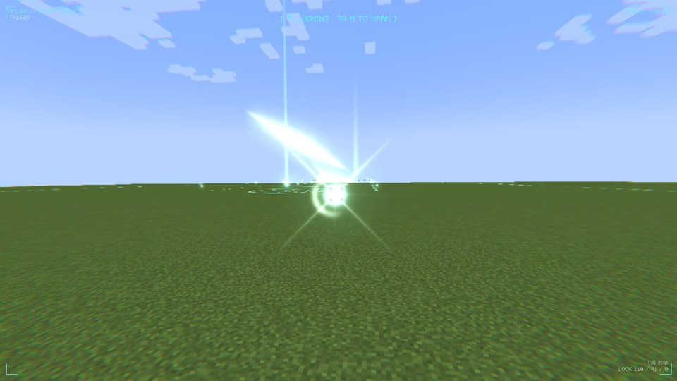
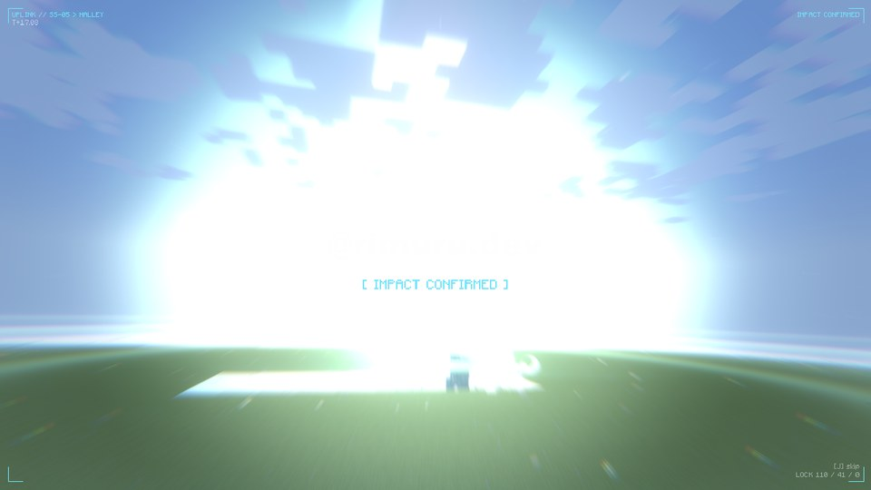
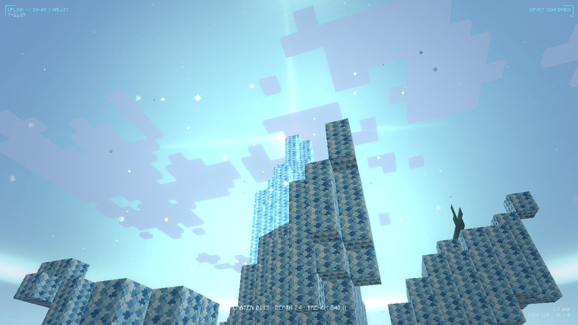
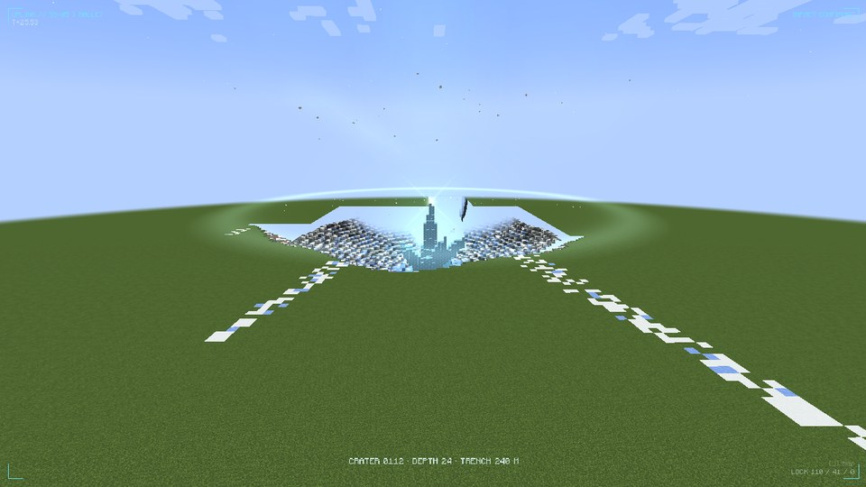
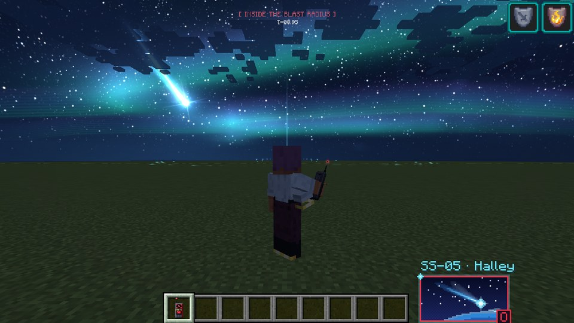
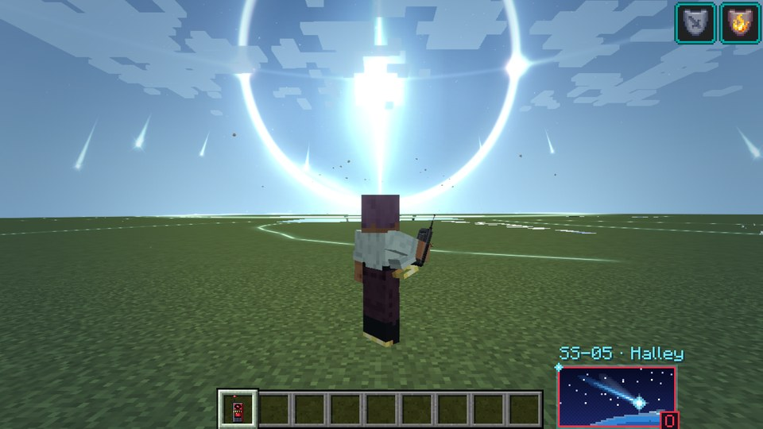
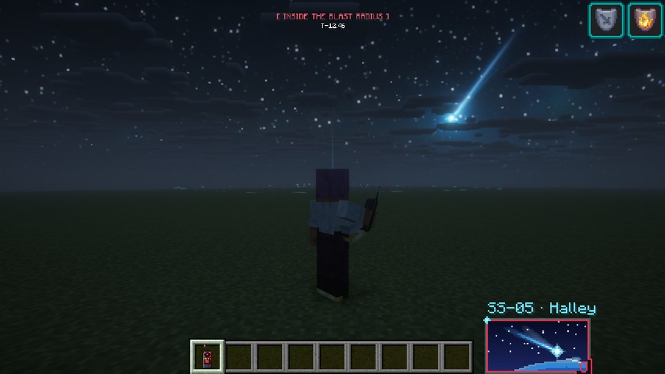

# The Shooting Star Addition

An **unofficial**, fan-made addon for [The Shooting Star [Demo]](https://www.curseforge.com/minecraft/mc-mods/the-shooting-star-demo)
by rimuru_dev. It adds a new skill to the Stellar Remote: **SS-05 · Halley**, a comet called down onto your
crosshair.

**Download:** [The Shooting Star Addition on CurseForge](https://www.curseforge.com/minecraft/mc-mods/the-shooting-star-addition)



> **Compatibility:** this branch (`forge-1.20.1`) is the **Forge, Minecraft 1.20.1** version, for **The Shooting
> Star [Demo] 1.3.3 or newer** (its Forge file, which carries the 1.20.1 build; tested with 1.3.4) (1.3.3 renamed The Shooting Star's code, so older versions of the addon can't attach to it, and this one can't attach to anything before 1.3.3). Other versions of the addon: NeoForge 1.21.1
> (`main`) and Fabric 26.3 (`fabric-26.3`). See
> [Will it work with future versions?](#will-it-work-with-future-versions-of-the-shooting-star) below.

## SS-05 · Halley

Flip the cover and press the button. Your crosshair is marked in ice-blue and an approach corridor is projected
across the land beyond it. A comet rises over the horizon with its tails stretched across the sky, hits the atmosphere
as a fireball, touches down at the far end of the corridor, ploughs a frozen trench back toward you and detonates on
the mark — leaving an icy crater with the comet's glowing heart standing in it, and rays of frost thrown out over the
land round it.

- **The sky goes dark as it comes in**: stars come out, the band of the galaxy, an aurora, and the comet blazes
  across them with its tails, lighting up the air round it. The fireball outshines the stars as it comes down, the
  blast lights up the night, and then the air fills with ice: a pale haze with a halo, sun dogs and a light pillar
  round the sun (or the moon), clearing as the crystals settle.
- **You can't miss it**: outside the cutscene the comet is drawn bigger, and an arrow at the edge of the screen points
  at it while it's out of view.
- **Works with shader packs** (Oculus, the Forge port of Iris, e.g. with Complementary): with one on, SS-05 paints its comet and sky onto textures
  and draws them the way the pack expects, and the dark sky becomes the pack's own night: the sky's clock races through
  a dusk into the night as the comet comes in, and on through a dawn after the impact. Only what you see changes, never
  the world's actual time.
- Pieces break off the comet and burst in the sky, the fireball sheds sparks and throws lens flares, ice is thrown
  out of the crater on long arcs, glowing cracks race across the land, a wall of snow rides the shock front, and the
  comet heart shines a beam into the sky.
- Joins the Stellar Remote like the built-in skills: its own key (**O** by default), menu card and description, HUD
  card, cooldown and recharge display.
- Its own cutscene (skippable with the remote's cutscene key), with impact frames, flashes and camera shake in the
  remote's style, and the remote's cover, button and screen animate for it.
- Thirteen new sounds, and two new blocks: the **Comet Heart** and the **Frozen Comet Trail**.
- Everything in the trench and the crater is erased, the way the remote's other skills erase their strike zones (you
  too if you stand there; in creative you are lifted clear). Past the crater, the shock wave throws, hurts and
  freezes whatever it meets.
- **It permanently changes the land.** Back up worlds you care about, as with the original mod.

| | | |
|---|---|---|
|  |  |  |
|  |  |  |
|  |  |  |

## Installing

1. Minecraft **1.20.1** with **Forge 47.1 or newer** (47.4.x recommended).
2. **The Shooting Star [Demo] 1.3.3 or newer** (its Forge file).
3. `shooting_star_addition-1.1.1+1.20.1.jar` ([CurseForge](https://www.curseforge.com/minecraft/mc-mods/the-shooting-star-addition))
   in the same `mods` folder. On a server, it goes on the server **and** on every player's client.

In game: hold the Stellar Remote, press **O** (or pick SS-05 in the remote's menu, **H**), aim at the ground and
right-click. The key can be changed in Controls or from the remote's menu like the others.

## Settings — `config/shooting_star_addition-common.toml`

| Section  | Setting                    | Default | What it does |
|----------|----------------------------|---------|--------------|
| skill    | `cooldown_seconds`         | 60      | Recharge time (the remote's own skills use 60). |
| skill    | `reach`                    | 420     | How far away the crosshair can place the mark. |
| impact   | `trench_length`            | 240     | Length of the trench ploughed toward the mark. |
| impact   | `trench_width`             | 30      | Width of the trench where it meets the crater. |
| impact   | `trench_depth`             | 22      | Depth of the trench. |
| impact   | `crater_radius`            | 56      | Radius of the crater; everything inside dies. |
| impact   | `crater_depth`             | 24      | Depth of the crater. |
| impact   | `blast_reach`              | 2.6     | Shock wave reach, in crater radii (throws, hurts, freezes). |
| world    | `carve_terrain`            | true    | `false` = the strike only hurts creatures, the land is untouched. |
| world    | `leave_comet_heart`        | true    | The glowing heart crystal and the frozen trail down the trench. |
| world    | `frost_rays`               | true    | Rays of snow painted out from the crater. |
| safety   | `evacuate_creative_caster` | true    | Lift a creative-mode caster out of the crater first. |

The server's values are sent with every strike, so every client films exactly the crater the server cuts.

## Looks — `config/shooting_star_addition-client.toml`

Each player can set these for themselves; they only change what you see.

| Setting          | Default | What it does |
|------------------|---------|--------------|
| `sky`            | true    | The sky goes dark while the comet comes in, and hazy with ice after the impact. |
| `darken_land`    | true    | The land dims under that dark sky, so the comet's light stands out. |
| `extra_effects`  | true    | Fragments, sparks, ice from the crater, cracks, the shock wall, the heart's beam, glittering air. |
| `world_flashes`  | true    | The whole world lights up for an instant at touchdown and impact. Turn off if flashing light bothers you. |
| `comet_marker`   | true    | The arrow at the edge of the screen pointing at the comet while it's out of view. |
| `shader_packs`   | AUTO    | How it's drawn with a shader pack: `AUTO` switches to the shader-pack way whenever Oculus has a pack on, `ALWAYS` uses it all the time, `NEVER` doesn't (the comet and the sky then won't show under a shader pack). |

## Will it work with future versions of The Shooting Star?

Honestly: maybe, maybe not. The Shooting Star has no official way for other mods to add skills, so this addon
attaches itself to some of its internals (the remote's skill list, its effect system and a few of its classes), and
The Shooting Star is updated often. That means:

- **Small updates** that don't touch those parts should keep working: the addon accepts The Shooting Star 1.3.3 and
  anything newer.
- **Updates that change those parts** won't crash your game. The addon checks everything before it attaches, and if
  something has moved it switches SS-05 off, logs why, and tells server operators in chat. It stays off until this
  addon is updated. The optional touches (the remote's cover animation, the cutscene overlay, the raised arm) quietly
  switch themselves off instead.
- **If The Shooting Star changes its mod id** (for example when it stops being a demo), this addon won't load until
  it is updated.
- **Other mod loaders and Minecraft versions** each need their own build: this one is Forge 1.20.1; there are also
  NeoForge 1.21.1 and Fabric 26.3 versions.

## Plans

This is version 1.1. If people enjoy it and there's support for it, I'll keep it updated for new versions of The
Shooting Star and keep improving it: more skills for the Stellar Remote, balancing and polish from your feedback,
and versions for other loaders and Minecraft versions if there's demand. Bug reports, ideas and feedback are very
welcome in the issues.

---

## For developers

### Building

Gradle runs on JDK 17-21 and fetches JDK 17 for the build itself. Put The Shooting Star's Forge jar in `libs/` (see
`libs/README.txt`); the build remaps it to Mojang names for compiling and for the dev runs (ModDevGradle Legacy), then:

- `./gradlew build` → `build/libs/shooting_star_addition-<version>.jar`, reobfuscated to SRG names with a mixin
  refmap: that's the one to release (`build/devlibs/` holds the dev-named jar, not for release)
- `./gradlew runServer` → a dev server with both mods loaded
- `./gradlew runServerTest` → a dev server that casts SS-05 for real in a fresh world, checks what it did and stops
  (`src/servertest`, not part of the addon's jar; look for `[SS05TEST]` in `run/servertest/logs/latest.log`)
- `./gradlew runClient` → a dev client. **The Shooting Star's 1.20.1 client mixins don't run in a dev client** (they
  name their targets in SRG, with no refmap, and Mixin can't map their `@Shadow`s to Mojang names), so it crashes on
  start. Test client-side things with the built jar in a normal Forge 1.20.1 install instead.

### When The Shooting Star updates

Only the files in `compat/` touch The Shooting Star; nothing else imports it. So:

1. Delete the old jar from `libs/`, put the new one in, and run `./gradlew build` (then `./gradlew runServerTest`).
   - If its version scheme changed, widen `shooting_star_version_range` in `gradle.properties`.
   - If its mod id changed (e.g. once it is no longer a demo), set `shooting_star_mod_id` there too.
2. **It compiles** — start the game. The log should say
   `SS-05 Halley joined the Stellar Remote as skill #N`. If so, you're done.
3. **Compile errors** — they will be in `compat/` only:
   - a renamed package or class: fix the imports in `compat/StarBridge.java`, `compat/HalleySkill.java`,
     `compat/HalleySpell.java` and `compat/client/*.java`;
   - a moved helper (spell engine, aiming, carving, erasure, the evac lift): each is a one-line wrapper at the
     bottom of `StarBridge.java` — point it at the new method.
4. **The log says "SS-05 Halley couldn't attach"** (operators also get a red chat message on joining): the remote's
   skill list (`SkillSet`) changed shape. The private field names the addon writes to are constants at the top of
   `StarBridge.java` — rename them to match.
5. **Smaller things that may stop without breaking anything** — optional mixins in `compat/mixin/` that switch
   themselves off if their target moved:
   - the remote's cover/button/screen not animating for SS-05 → `RemoteRendererMixin` (`strikeTime`);
   - no SS-05 overlay on the cutscene → `FxManagerMixin` (`renderFilmHud`);
   - the caster's arm not raising (vanilla target, very unlikely to change) → `PlayerModelMixin`;
   - the land not dimming under the dark sky (vanilla target, very unlikely to change) → `ClientLevelMixin`;
   - with a shader pack on, the sky not going to night (vanilla target, very unlikely to change) →
     `ClientLevelTimeMixin`.
6. **A new built-in skill takes the O key** → change `DEFAULT_KEY` in `world/HalleyInfo.java`.

If the remote gains more built-in skills, SS-05 simply joins after them.

### Changing the skill

| To change… | Look in |
|---|---|
| Sizes, cooldown, what it leaves behind | `config/shooting_star_addition-common.toml` (defaults in `HalleyConfig.java`) |
| The timeline (when it is sighted, enters, touches down) | `HalleyPlan.java` — film, sounds and server all follow it |
| What it does to the world | `world/HalleyStrike.java` (block palettes at the top) |
| Name, colour, default key | `world/HalleyInfo.java`; description and key name in `assets/shooting_star_addition/lang/en_us.json` |
| The look: colours, comet size, tails | top of `client/render/CometVisuals.java`; shapes in `halley_glow.fsh` |
| The extras: fragments, ice from the crater, cracks, shock wall, beam | top of `client/render/CometExtras.java` |
| The sky: when it darkens, the aurora, the haze | `sky()` in `client/HalleyFx.java` (timing); `halley_sky.fsh` (the look) |
| Shader packs (Oculus) | `client/render/ShaderPacks.java` (when), `GlowAtlas.java` (the painted shapes), `paint()` in `client/sky/HalleySky.java` |
| Sounds, particles, screen effects, HUD | `client/HalleyFx.java`, `client/HalleyHud.java` |
| The cutscene | `client/film/HalleyStoryboard.java` (one block per shot) |
| Textures, menu card, thumbnail, sounds themselves | `art/` (generator scripts — see `art/README.md`) |

### Project layout

```
src/main/java/dev/ss05/halley/
  HalleyAddon.java       mod entry point
  HalleyConfig.java      the settings file
  HalleyPlan.java        timeline and geometry, shared by server and client
  HalleyParams.java      the sizes of one strike, sent to clients with it
  compat/                everything that touches The Shooting Star (server side, client side, mixins)
  content/               blocks, sounds, damage type
  world/                 what the strike does to the world (server)
  client/                what it looks and sounds like (renderer, effects, HUD, cutscene)
  client/sky/            the sky during a strike (night, aurora, the ice haze)
src/main/resources/      shader, textures, sounds, language file, data
src/main/templates/      META-INF/mods.toml (filled in from gradle.properties)
src/servertest/          the dev-only game-logic test (./gradlew runServerTest)
art/                     scripts that generate the textures, thumbnail and sounds
docs/screenshots/        in-game screenshots
```

## Credits

The Shooting Star and the Stellar Remote are by **rimuru_dev** (All Rights Reserved). This addon is not affiliated
with or endorsed by them, and contains none of the original mod's code or assets — you need the original mod
installed for it to do anything.
